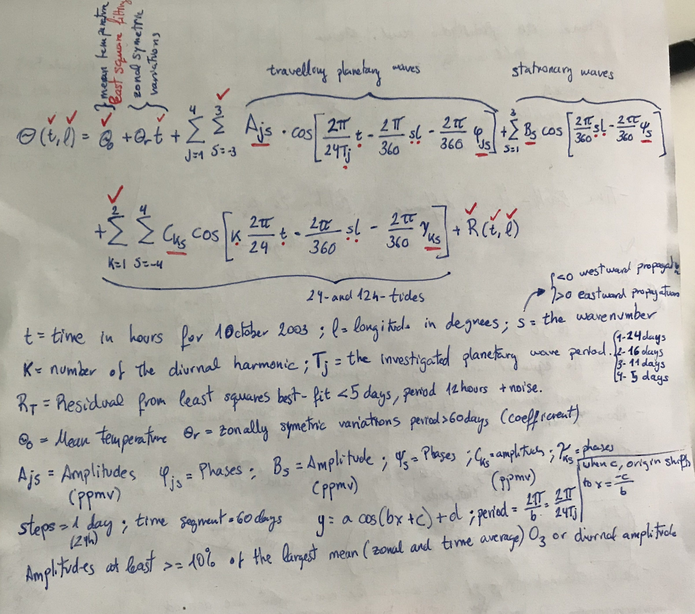

# SABER_analysis
The work to be done with SABER data is a beautiful project that can be used with many different purposes. At first it may seem too much data to understand and clean but it has a lot to extract.
This work can produce many publications, so it's not so important how fast you go at first, but how well you understand the process.

To download data:
There are two ways of downloading the data:
•	Having one connection downaloading all at once. But it would take over a month to do it. 
•	Taking into account that you cant have more than two simultanous connections, my recomendation is to download it by years. You can use different servers at the same time. (The web server and Lancelot at the same time). Downloading 4 years at a time.  
Example: wget -r ftp://anonymous:@saber.gats-inc.com/Version2_0/Level2A/2003

Page to know about SABER: http://saber.gats-inc.com/

ABOUT work on SABER:

The objective of this work is the following:

•	Use Pancheva’s method to reproduce the non-migrating tidal variations in the mesospheric ozone (O3) and Temperature and extend it 7 more years.  (THESE ARE CONCENTRATIONS)

•	Extract the OH and O2(1Delta) tidal fields using the same method  and see the spatial distribution and seasonal variability of the three strongest nonmigrating OH and O2(1Delta)  tidal variabilities, i.e., SW3, DW2, and DE3, and compare them with the O3 tidal variabilities.   (FOR OH WE WILL HAVE  RADIANCES; FOR O3 WE WILL HAVE RADIANCES AND O3)

To get a sense of what has to be done you have to read the following two papers:
•	https://agupubs.onlinelibrary.wiley.com/doi/full/10.1002/2014GL059844 - In this paper you have to read it in general to get to know the idea of what we want to do. Focus on points 1 & 2, to understand the methodology and the data in which you are interested in.
•	https://www.sciencedirect.com/science/article/pii/S1364682608002691?via%3Dihub - In this paper is where the actual methodology and formulation it is explained. Focus on points 1 (similar to point 1 in the previous paper), 2 and 3 (this point is where you find the formula to extract the tides) are interesting for the methodology.

Each file consists of these variables: 
SABER L2A netCDF file contents: http://saber.gats-inc.com/saber_doc/SABER_level2A_NCDUMP_v2.pdf

To know about SABER data with python you can have a look at this PDF carefully: https://home.uni-leipzig.de/jacobi/docs/2009_LIM_1.pdf
You will see step by step how to treat the data. 

In the "Saber_single.py" script you will find how to treat a single SABER orbit. It has steps by step how to clean the data taking into account what is told in Pancheva papers. 

In the "Saber.py" script you will find see how to read a complete day and extract a list with all the data. You will also be able to see it plotted around the globe. After this, a 3 standard deviation is done to know the minimum and the maximum values of the range. At the end of the script where the "TODO" tag is, is where the work as been left. I have written down the formula explaining what is each variable in the "Pancheva_formula.jpg" image.

